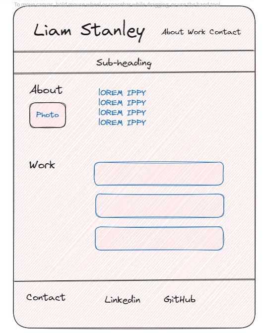

# Unit 2 Challenge: Portfolio 

## Contents
Description
Installation
Usage
Learnings / Future Work 
Credits
Licence
Screenshots

## Description

This is my professional-portfolio-v2, (V1 can be found below) which includes a professional CV covering my 11+ years of digital market & paid media experience.

It also includes links to new projects that I have worked on as part of my Front-End career development Bootcamp. 

V1 - https://liamss.github.io/professional-portfolio/ 
V2 -  https://liamss.github.io/professional-portfolio-v2/
V2 Github - https://github.com/Liamss/professional-portfolio-v2

## Installation

You can open this in your favourite browser 

## Usage

Please visit the URL to see the latest deployed version

## Learnings / Future Work 

1. Image cards have the same width but varying height - tried to resize images and overlay CSS 
2. Removing Card titles and having the whole element clickable, seems to be best achieved in Javascript which we'll start this week. 
3. Learning to keep CSS to a minimum when it can be achieved in bootstrap, still working out the balance. 

## Credits
N/A

## License
MIT

## Screenshots 

Drawing of how I initially wanted the portfolio to look site to look. 

My plan is to get closer to this using Bootstrap. 

